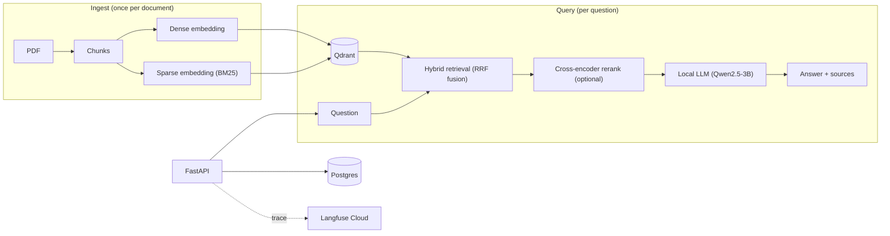

# production-rag
ContextForge — Production RAG &amp; Knowledge Retrieval Platform

A Retrieval-Augmented Generation system built incrementally, version by version, from a naive
pipeline to an evaluated, observable, containerized service, each stage added to fix a concrete
limitation the previous one exposed, not because the technology sounded good. Every design
decision below is backed by a real measurement, not intuition. See
[docs/production_rag_roadmap.md](docs/production_rag_roadmap.md) for the full build plan this
followed.

Indexed corpus: `data/pytorch.pdf`, PyTorch's official documentation, 2,853 pages, 8,813 chunks.

## Architecture



Everything except Langfuse's trace metadata runs locally: embeddings, reranking, and generation
are all local models on GPU, no hosted LLM API keys anywhere in this project.

## Tech stack

| Layer | Tools |
|---|---|
| Retrieval | Qdrant (dense + sparse named vectors), `sentence-transformers` (BGE), `fastembed` (BM25), a cross-encoder reranker |
| Generation | Hugging Face `transformers`, `Qwen/Qwen2.5-3B-Instruct`, local GPU (CUDA) |
| Orchestration | LangChain (PDF loading, chunking) |
| API | FastAPI, Pydantic, `uvicorn` |
| Data | PostgreSQL (SQLAlchemy), Qdrant |
| Ops | Docker Compose, Langfuse Cloud (tracing), `pytest`, GitHub Actions |
| Tooling | `uv` |

## Quickstart

```bash
uv sync
docker compose up -d              # qdrant + postgres containers
uv run python ingest.py           # index data/*.pdf
uv run python ask.py "What is a tensor in PyTorch?" --mode hybrid
```

No Docker available, or just a quick local test? Blank `QDRANT_URL` in `.env` to fall back to
embedded/on-disk Qdrant and use a `sqlite:///` `DATABASE_URL`, both fully supported, not just a
fallback stub, this is how the whole project ran through V0-V3.

Or run it as a service instead of the CLI:

```bash
uv run python serve.py            # http://localhost:8000, Swagger UI at /docs
```

Full setup detail (evaluation harness, tests, CI) is in the [build log](#build-log-v0--v4) below.

## Results

V1 added hybrid retrieval and reranking on intuition ("this should help"). V2 measured it on a
30-question evaluation set (chunk-grounded synthetic Q&A, gold citations known by construction, no
hand-labeling) instead of trusting that intuition:

| Mode | Recall@5 | MRR | nDCG@5 | Faithfulness | Latency |
|---|---:|---:|---:|---:|---:|
| dense | 0.733 | 0.536 | 0.586 | 4.00 | 1007 ms |
| **hybrid** | **0.833** | **0.623** | **0.676** | **4.30** | **991 ms** |
| hybrid_reranker | 0.733 | 0.625 | 0.652 | 4.10 | 1985 ms |

**Hybrid wins on every metric and is the recommended default.** Reranking does not help on this
evaluation set, drops Recall@5 back to dense's level while roughly doubling latency, a real,
measured, counter-intuitive result, not a bug (see
[Engineering decisions](#engineering-decisions) and [docs/v2-notes.md](docs/v2-notes.md) for why).

## API reference

```bash
uv run python serve.py
```

| Endpoint | Purpose |
|---|---|
| `GET /health` | Qdrant and database reachability |
| `POST /documents` | upload a PDF, indexed in the background |
| `GET /documents` | list documents and their status |
| `DELETE /documents/{id}` | remove a document |
| `POST /query` | ask a question, get an answer with sources |
| `POST /feedback` | rate an answer by its `query_id` |

```bash
curl -F "file=@data/pytorch.pdf" http://localhost:8000/documents
curl -X POST http://localhost:8000/query \
  -H "Content-Type: application/json" \
  -d '{"question": "What is a tensor in PyTorch?", "mode": "hybrid"}'
```

Swagger/OpenAPI docs are auto-generated at `/docs` once the server is running.

## Example questions and answers

Real output, `hybrid` mode, not edited for effect.

**Semantic query:**
```text
$ uv run python ask.py "What is a tensor in PyTorch?" --mode hybrid

Answer:
A tensor in PyTorch is a multi-dimensional matrix or array used for numerical computations.
It can represent various types of data including scalars, vectors, and matrices. Tensors are
fundamental to PyTorch's operations and are used extensively in deep learning models.

Sources (mode=hybrid):
- pytorch.pdf, page 193 (score=0.5000)
- pytorch.pdf, page 596 (score=0.5000)
- pytorch.pdf, page 454 (score=0.3333)
- pytorch.pdf, page 942 (score=0.2500)
```

**Exact-API-term query** (the kind dense-only search alone gets wrong, see
[docs/v1-notes.md](docs/v1-notes.md)):
```text
$ uv run python ask.py "torch.nn.Conv2d" --mode hybrid_reranker

Answer:
torch.nn.Conv2d represents a 2D convolutional layer in PyTorch, similar to the ConvBnReLU2d
and ConvReLU2d classes described in the context. It has an interface that can be extended
with FakeQuantize modules for quantization-aware training.

Sources (mode=hybrid_reranker):
- pytorch.pdf, page 2495 (score=8.2455)
- pytorch.pdf, page 2488 (score=7.9029)
- pytorch.pdf, page 2491 (score=7.6704)
- pytorch.pdf, page 2494 (score=7.4408)
```

## Engineering decisions

Direct answers to the roadmap's own "what problem does it solve, what were the alternatives, why
this one" questions for the choices that aren't self-explanatory.

- **LangChain, not LangGraph.** The pipeline is linear (retrieve, maybe rerank, generate), no
  branching, retries, or agentic control flow. LangGraph would add orchestration complexity with
  nothing to orchestrate yet. Revisit if V6 (agentic/adaptive retrieval, query rewriting) happens.
- **Qdrant.** Needed dense + sparse vectors in one collection, metadata filtering (for
  per-document delete in V3), and a mode that runs both embedded (no server) and as a real
  container, without changing application code. Alternatives considered: FAISS (no server mode,
  no sparse support), pgvector (would've coupled retrieval storage to the app's relational DB).
- **BM25 added in V1, as a second named vector inside Qdrant** (via `fastembed`'s `Qdrant/bm25`
  model), not a separate hand-rolled index. Dense embeddings miss exact terms (`torch.nn.Conv2d`,
  error codes); BM25 catches them. One database, one query, less custom code to own.
- **Hybrid retrieval was built and measured, reranking was built and measured differently.**
  Both were added in V1 on the same reasoning ("this is what better retrieval looks like"). V2's
  evaluation confirmed hybrid, and **contradicted** reranking: it dropped Recall@5 back to dense's
  level and roughly doubled latency, on this evaluation set. The response wasn't to remove the
  reranker, it's to not default to it, `hybrid_reranker` stays a selectable mode, `hybrid` is the
  default. That's the actual point of V2: a technology gets evaluated in place, not assumed in or
  assumed out.
- **How retrieval was evaluated:** Recall@K, MRR, nDCG@K, context precision, all computed against
  a 30-question set whose gold citations came from the indexing pipeline itself (sample a chunk,
  ask the local LLM to write a question about it), not hand-labeled, so there was no manual
  citation-writing to get wrong.
- **How generation was evaluated:** the same local LLM, in a separate judge role, scoring
  faithfulness (does the answer only claim what the context supports) and relevancy (does it
  answer the question) 1-5, a known limitation (self-grading bias), stated plainly rather than
  presented as rigorous, see [docs/v2-notes.md](docs/v2-notes.md).
- **Quality/latency trade-off:** hybrid is both the highest-quality and the fastest of the three
  modes here, an unusually clean result. The real trade-off in this project was containerization
  cost, not retrieval mode: self-hosted Langfuse worked but needed 6 extra containers for a
  single-developer project, replaced with Langfuse Cloud's free tier, see
  [docs/v4-notes.md](docs/v4-notes.md).

## Observability

Every query is traced end to end via Langfuse (retrieval, embedding, reranking when used, and
generation each as their own span, with latencies and token counts, nested under one trace per
question). Real captured trace:

```text
CHAIN       rag.answer_question   30.2s
  RETRIEVER retrieval              7.1s
  EMBEDDING dense-embedding        5.9s
  GENERATION generation            9.4s
```

`LANGFUSE_PUBLIC_KEY`/`LANGFUSE_SECRET_KEY` unset disables this cleanly, the app runs identically
with tracing silently off, verified, not just documented (see [docs/v4-notes.md](docs/v4-notes.md)).

## Limitations

Stated directly rather than left for a reader to discover:

- **Single-document corpus.** Everything here is evaluated against one PDF. Multi-document
  behavior (topic drift across sources, cross-document citation conflicts) is untested.
- **Reranking underperforms on this evaluation set** (see Results above), likely because the
  synthetic eval questions share vocabulary with their source chunk in a way that favors
  lexical/dense overlap over the cross-encoder's general relevance training. Not necessarily true
  on a different, larger, or more naturally-phrased question set.
- **Langfuse Cloud is the one non-local piece.** Trace metadata (questions, answers, retrieval
  scores, latencies) leaves the machine; the retrieval/generation pipeline itself stays 100%
  local either way.
- **No hosted demo.** Embeddings, reranking, and generation all need local GPU inference; a real
  deployment means renting GPU compute, out of scope here. This README's examples are real
  captured output instead of a live link.
- **No authentication** on the API, not in scope for this stage.
- **Document indexing uses FastAPI `BackgroundTasks`**, not a real task queue, fine at this scale,
  would need Celery/RQ/similar under real upload volume.
- **CI runs against embedded Qdrant + SQLite**, not the containerized Postgres/Qdrant stack, a
  deliberate speed/simplicity trade-off, see [docs/v4-notes.md](docs/v4-notes.md).

## Future improvements

- V6: agentic/adaptive retrieval (query rewriting, retrieval retries, LangGraph) once there's an
  actual routing/looping problem to solve, per the roadmap's own reasoning for not adding it yet.
- A larger, more naturally-phrased evaluation set to check whether the reranking result holds up.
- Multi-document ingestion and cross-document evaluation.
- Real PostgreSQL in CI instead of the SQLite fallback.

## Docs

- [docs/code-walkthrough.md](docs/code-walkthrough.md): what each module and function does.
- [docs/v0-notes.md](docs/v0-notes.md): dense-only retrieval baseline.
- [docs/v1-notes.md](docs/v1-notes.md): dense vs hybrid vs reranked, chunk-size trade-offs.
- [docs/v2-notes.md](docs/v2-notes.md): evaluation methodology, results table, and default configuration choice.
- [docs/v3-notes.md](docs/v3-notes.md): production API design decisions.
- [docs/v4-notes.md](docs/v4-notes.md): containerization, observability, and testing/CI decisions.

## License

[MIT](LICENSE)

---

## Build log (V0 → V4)

The detailed, version-by-version history: what each stage added, why, and how to run it at that
stage. Useful if you want the full incremental story instead of the summary above.

<details>
<summary><strong>V0 — Naive RAG</strong></summary>

The current version indexes `data/pytorch.pdf` and answers questions about it end to end:
PDF → chunks → local embeddings → Qdrant → retrieval → local LLM → answer with page citations.

Everything runs locally: embeddings via `sentence-transformers` (BGE), vector storage via an
embedded/on-disk Qdrant instance, and generation via a local Hugging Face model on GPU, no API
keys required.

### Setup

```bash
uv sync
```

### Usage

```bash
uv run python ingest.py             # index data/*.pdf into the local Qdrant store
uv run python ask.py "What is a tensor in PyTorch?"
```

Example output:

```text
Answer:
A tensor in PyTorch is a multi-dimensional matrix or array used for numerical
computations...

Sources:
- pytorch.pdf, page 596
- pytorch.pdf, page 454
```

Configuration (embedding model, LLM model, chunk size/overlap, top-k, storage paths) lives in
`src/rag/config.py` and can be overridden via environment variables, see `.env.example`.

See [docs/v0-notes.md](docs/v0-notes.md) for observed dense-only retrieval behavior and
limitations.

</details>

<details>
<summary><strong>V1 — Better Retrieval</strong></summary>

Dense-only search struggles on exact-term queries (API names, error codes). V1 adds BM25 sparse
retrieval as a second named vector in the same Qdrant collection (via `fastembed`'s `Qdrant/bm25`
model), fuses it with dense search using Qdrant's built-in Reciprocal Rank Fusion, and adds a
cross-encoder reranker (`cross-encoder/ms-marco-MiniLM-L-6-v2`) over the fused candidates.

Three retrieval modes are selectable at query time:

```bash
uv run python ask.py "torch.nn.Conv2d" --mode dense              # baseline, semantic only
uv run python ask.py "torch.nn.Conv2d" --mode hybrid             # dense + BM25, RRF-fused
uv run python ask.py "torch.nn.Conv2d" --mode hybrid_reranker    # hybrid, then cross-encoder reranked
```

`RETRIEVAL_MODE` in `.env`/`config.py` sets the default (`dense`). `CANDIDATE_K` controls how many
fused candidates are pulled before reranking.

To compare all three modes across a fixed set of semantic and exact-keyword queries:

```bash
uv run python compare_modes.py
```

See [docs/v1-notes.md](docs/v1-notes.md) for observed trade-offs between the retrieval modes and
between chunk sizes.

</details>

<details>
<summary><strong>V2 — Evaluation-Driven RAG</strong></summary>

V1 compared retrieval modes on a handful of hand-picked queries, eyeballed manually. V2 replaces
that with a labeled evaluation set and real metrics: Recall@K, MRR, nDCG, context precision/recall,
retrieval latency, and LLM-judged answer faithfulness/relevancy, computed for all three retrieval
modes.

```bash
uv run python -m evaluation.build_dataset   # generate the evaluation set (30 synthetic Q&A pairs)
uv run python -m evaluation.run_eval        # run retrieval + generation eval, write results.csv
```

Result: **hybrid** beats both dense and hybrid_reranker on every metric in this evaluation
(Recall@5 0.83 vs 0.73, plus better faithfulness/relevancy, at lower latency than the reranked
mode), so it's the recommended default. See [docs/v2-notes.md](docs/v2-notes.md) for the full
comparison table and interpretation, including the reranker's surprising underperformance here.

</details>

<details>
<summary><strong>V3 — Production API</strong></summary>

V0-V2 are scripts. V3 turns the pipeline into a FastAPI service backed by SQLite (real PostgreSQL
arrives in V4 alongside Docker Compose), so documents can be uploaded and queried over HTTP instead
of the CLI.

```bash
uv run python serve.py    # starts the API on http://localhost:8000, Swagger UI at /docs
```

See [docs/v3-notes.md](docs/v3-notes.md) for the SQLite/Postgres decision, the incremental
indexing design, and the model warm-up win over the CLI.

</details>

<details>
<summary><strong>V4 — Production Engineering</strong></summary>

V4 makes the stack operable: real containerized data services, full LLM observability, and
automated testing/CI.

```bash
docker compose up -d      # starts qdrant + postgres containers
uv run python ingest.py   # now indexes into the containerized Qdrant (QDRANT_URL is set by default)
uv run python serve.py    # now talks to containerized Postgres (DATABASE_URL is set by default)
```

Tests are split into two groups, **run as separate `pytest` invocations, not combined** (see
[docs/v4-notes.md](docs/v4-notes.md) for the real bug this avoids):

```bash
uv run pytest tests/ --ignore=tests/api   # unit tests + evaluation regression test
uv run pytest tests/api/                  # API integration tests, fully isolated
```

[.github/workflows/ci.yml](.github/workflows/ci.yml) runs both on every push/PR: `ingest.py`
against an embedded (Docker-free) Qdrant, then the full test suite, including a regression check
that Recall@5/MRR don't drop far below V2's committed baseline.

Both Qdrant and Postgres fall back to their V0-V3 Docker-free modes (embedded Qdrant, SQLite) by
blanking `QDRANT_URL`/overriding `DATABASE_URL`, verified working, not just documented.

See [docs/v4-notes.md](docs/v4-notes.md) for the host-run-API-vs-GPU-passthrough decision, why
observability is Langfuse Cloud rather than self-hosted, and real bugs found while building this
(a 32MB Qdrant request-size limit, a test-isolation bug that silently zeroed out a regression
check, and a CI slowdown from a churning lockfile plus CPU-bound LLM calls).

</details>
